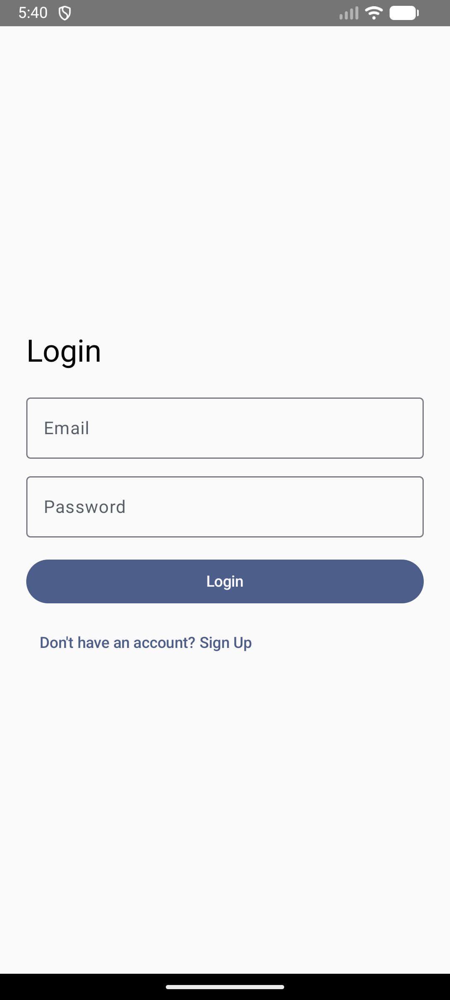
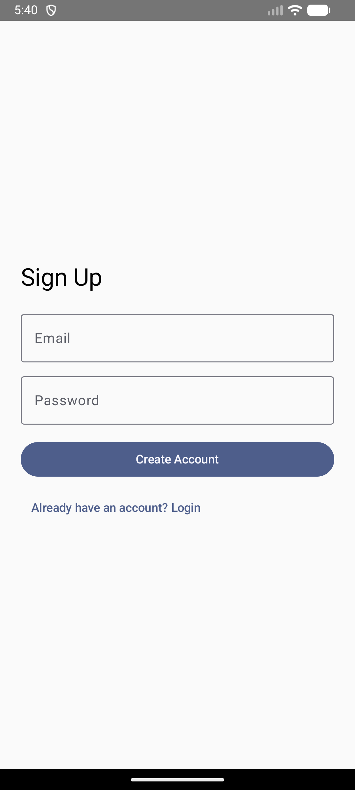
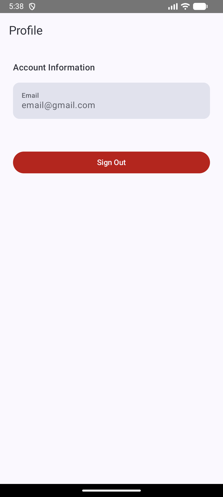
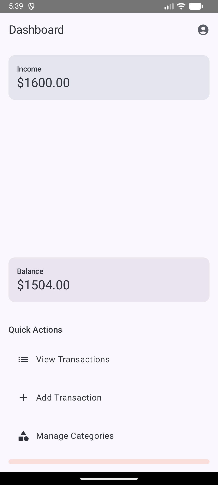
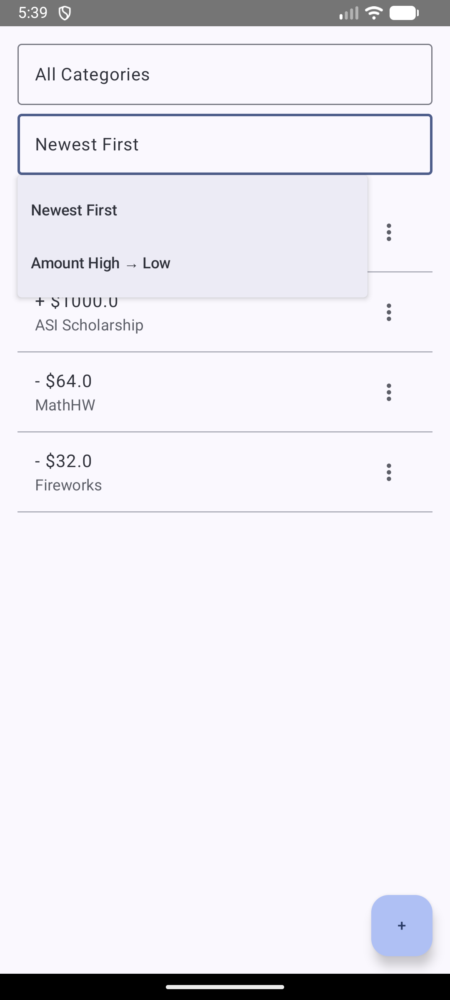
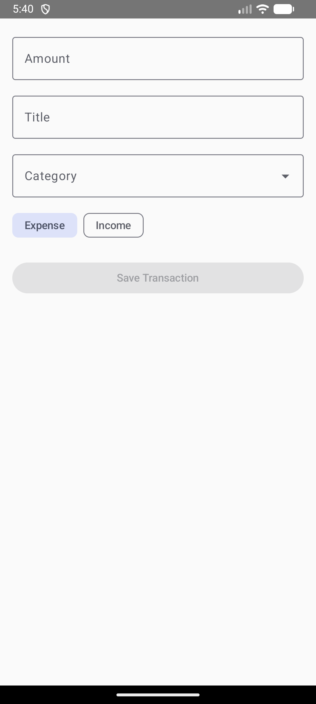
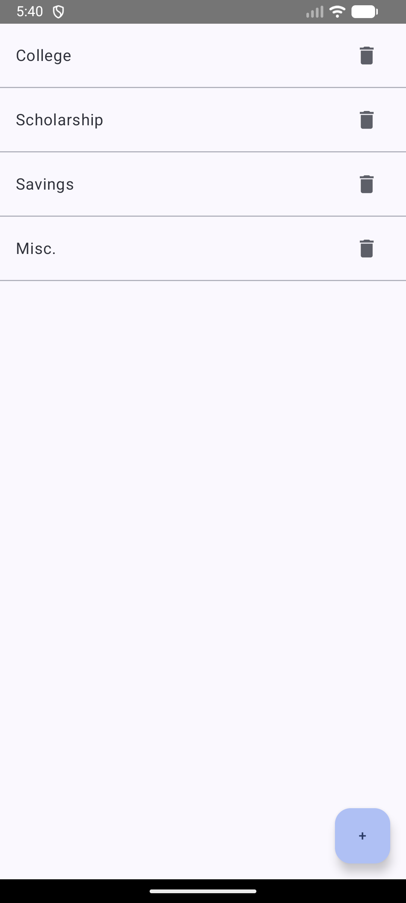

# 💰 Finance Tracker - Android App

Finance Tracker is a modern, intuitive Android application designed to simplify personal finance management. Built with Jetpack Compose, Firebase, and a clean MVVM architecture, it offers users a secure and seamless way to track income, manage expenses, and gain real-time financial insights.

---

### 📌 Project Overview

Managing personal finances can be overwhelming. Finance Tracker empowers users to take control of their financial health by providing a simple yet powerful platform to:

-   **Track** income and expenses effortlessly.
-   **Categorize** transactions for better organization.
-   **View** clear financial summaries and dashboards.
-   **Manage** data securely with Firebase Authentication and Firestore.
-   **Experience** real-time data synchronization and a smooth, responsive UI.

*This project was developed as part of a coursework submission and fully satisfies all required criteria.*

---

### 🎯 Features

**🔐 Authentication**
-   Secure email & password sign-up and login powered by **Firebase Authentication**.
-   Persistent login sessions for a seamless user experience.
-   Secure logout functionality.
-   User-specific data isolation ensuring privacy.

**💸 Transaction Management**
-   Add income and expense transactions with ease.
-   Edit existing transactions through an intuitive dialog.
-   Delete transactions with a confirmation prompt to prevent accidental data loss.
-   Real-time data synchronization with **Firestore**.
-   Filter transactions by category to quickly find what you'''re looking for.

**🗂 Category Management**
-   Create, edit, and delete custom spending categories.
-   Assign categories to transactions for detailed tracking.
-   All categories are user-specific and stored securely in Firestore.

**📊 Dashboard & Insights**
-   At-a-glance view of **Total Income**, **Total Expenses**, and **Current Balance**.
-   Visual summary of spending by category.
-   Quick navigation actions to other screens.

**🎨 UI & UX**
-   Built entirely with **Jetpack Compose** following **Material 3** guidelines.
-   Clean, modern, and intuitive user interface.
-   Graceful handling of loading, empty, and error states.
-   Confirmation dialogs for critical actions (e.g., delete).

---

### 🧱 Tech Stack & Architecture

**Frontend:**
-   `Kotlin`
-   `Jetpack Compose`
-   `Material Design 3`
-   `Navigation Compose`

**Backend & Database:**
-   `Firebase Authentication`
-   `Firebase Firestore` (with real-time listeners)

**Architecture & Concurrency:**
-   `MVVM (Model-View-ViewModel)`
-   `Repository Pattern`
-   `Kotlin Coroutines` & `StateFlow` for asynchronous operations.

**Application Structure:**
```
com.example.financetracker
│
├── auth/              → Authentication logic & UI
├── dashboard/         → Dashboard UI & ViewModel
├── transactions/      → Transaction CRUD (UI, VM, Repo)
├── categories/        → Category CRUD (UI, VM, Repo)
├── navigation/        → Navigation routes & NavGraph
└── MainActivity.kt
```

---

### 🗃 Data Models

**`Transaction`**
-   `id`: `String`
-   `title`: `String`
-   `amount`: `Double`
-   `type`: `String` (INCOME / EXPENSE)
-   `categoryId`: `String`
-   `timestamp`: `Timestamp`

**`Category`**
-   `id`: `String`
-   `name`: `String`
-   `color`: `String` (Hex code)
-   `createdAt`: `Timestamp`

---

### 📸 Screenshots & Demo

| Screen          | Preview     |
| :-------------- | :---------: |
| **Login**       |    |
| **Sign Up**     |    |
| **Profile**     |    |
| **Dashboard**   |    |
| **Transactions**|    |
| **Add Transaction** |    |
| **Categories**  |    |

#### 🎥 Video Walkthrough

📺 **YouTube Demo (Unlisted):** https://youtube.com/shorts/TB-vJl5Pvu4

The video demonstrates:
-   Authentication flow (Sign-up & Login).
-   Full CRUD operations for both transactions and categories.
-   Real-time dashboard analytics.
-   Filtering functionality.
-   Overall app navigation and user experience.

---

### 🚀 Setup Instructions

1.  **Clone the repository:**
    ```bash
    git clone https://github.com/atomar1/financetracker.git
    ```
2.  Open the project in **Android Studio**.
3.  **Add your `google-services.json` file** to the `app/` directory.
4.  **Enable in Firebase Console:**
    -   Firebase Authentication (Email/Password provider).
    -   Firebase Firestore.
5.  **Sync Gradle** and run the app.

---

### ✅ Project Requirements Checklist

-   [✔] Authentication with Firebase
-   [✔] Persistent login session
-   [✔] Two Firestore entities (Transactions & Categories)
-   [✔] Full CRUD operations for both entities
-   [✔] Real-time data synchronization
-   [✔] MVVM architecture
-   [✔] Navigation Component (Navigation Compose)
-   [✔] Material 3 UI
-   [✔] Confirmation dialogs for destructive actions
-   [✔] Filter functionality
-   [✔] Clean, well-structured code

---

### ⭐ Going the Extra Mile

-   **Enhanced UX:** Dialog-based editing and deleting provides a smoother user experience.
-   **Reactive Data:** Use of `StateFlow` and Firestore'''s real-time listeners for a reactive UI.
-   **Clean Architecture:** Strong separation of concerns between UI, ViewModel, and Repository layers.
-   **Dashboard Analytics:** Logic for summarizing financial data on the dashboard.
-   **Scalable Structure:** The architecture is designed to be easily extendable.

---

### 👨‍💻 Author

**Ansh Tomar**
*Android Developer | Kotlin | Jetpack Compose | Firebase*

---

### 📜 License

This project is developed for academic and educational purposes.
